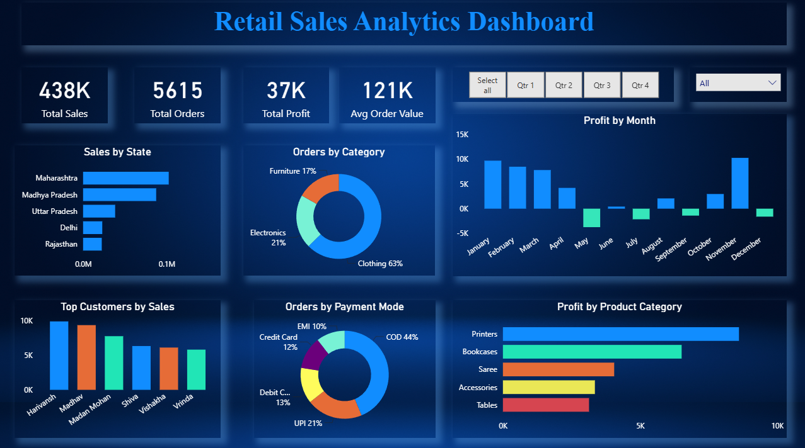

# Retail Sales Analytics Dashboard
A Power BI dashboard project analyzing retail sales performance, customer behavior, payment methods, and profitability trends.

## Project Overview
This Power BI dashboard provides insights into retail sales performance, customer purchasing behavior, product profitability, and payment trends. The dashboard helps identify high-performing states, product categories, and customers through interactive visualizations.

## Key Metrics
- Total Sales
- Total Orders
- Total Profit
- Average Order Value

## Features
- Sales by State
- Orders by Category
- Monthly Profit Analysis
- Top Customers Analysis
- Payment Mode Analysis
- Product Category Profit Analysis

## Tools Used
- Power BI
- CSV Dataset
- Data Visualization
- Data Modeling

## Dataset
- Orders.csv
- Details.csv

## Dashboard Preview

